# Local AWS Simulator

[](https://github.com/manojbarot1/Local-AWS-Simulator/actions/workflows/ci.yml)

A local, offline AWS training environment: an AWS-console-style web app **and**
an AWS-compatible API endpoint that the real `aws` CLI and `boto3` talk to —
sharing one SQLite database. Build landing zones, VPCs, workloads, storage,
identity and serverless pieces, and the simulator checks your work the way AWS
would: CIDR rules, dependency violations, routing, security groups, NACLs.

No AWS account, no credentials, no cost, no Docker — just Python and Flask.

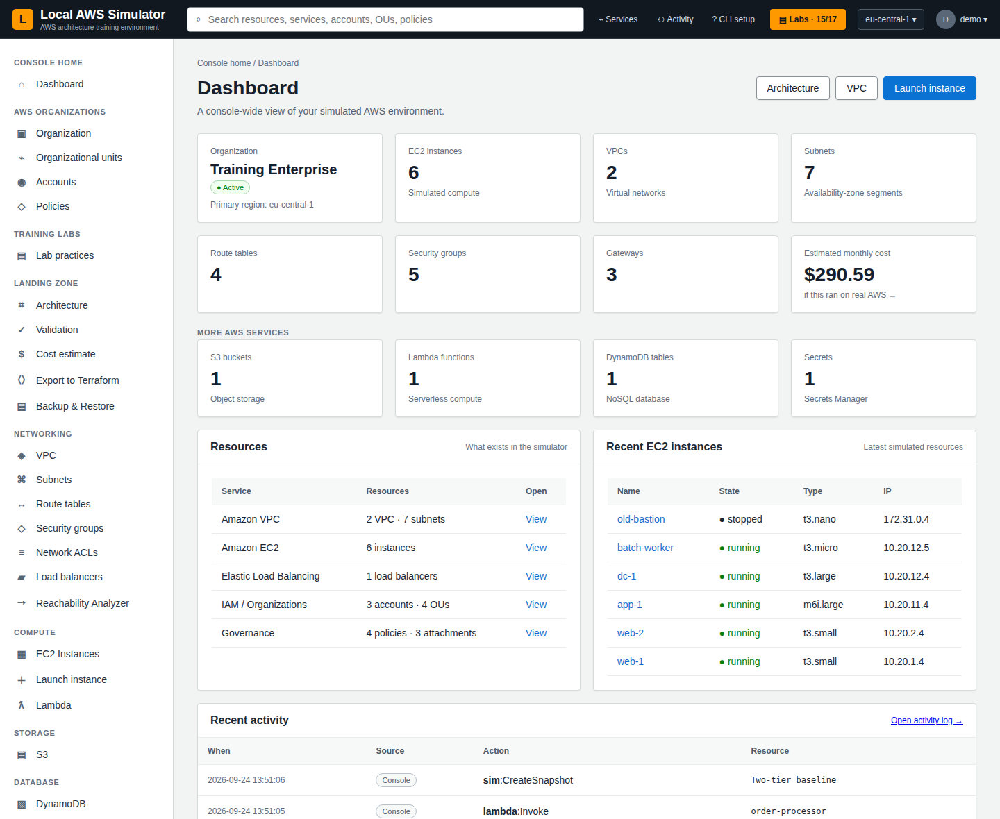

## Quick start

```bash
git clone https://github.com/manojbarot1/Local-AWS-Simulator.git
cd Local-AWS-Simulator
python3 -m venv .venv && source .venv/bin/activate
pip install -r requirements.txt
python3 app.py
```

Open http://127.0.0.1:8080 and sign in with **demo / demo**.

Want a populated environment to explore first?

```bash
pip install -r requirements-dev.txt
python3 tools/demo_seed.py demo.db
SIM_DB=demo.db python3 app.py
```

## What you can do

### Reachability Analyzer — "why can't my instance reach the internet?"

Trace any path hop by hop: instance state, security groups (stateful), network
ACLs in both directions (stateless — return traffic on ephemeral ports is
checked too), the subnet's effective route table with longest-prefix match,
and the gateway it points at. An internet gateway needs a public IP on the
instance; a NAT gateway must itself sit in a public subnet.

| Private instance → internet via NAT | Internet → public instance on port 22 |
|---|---|
| 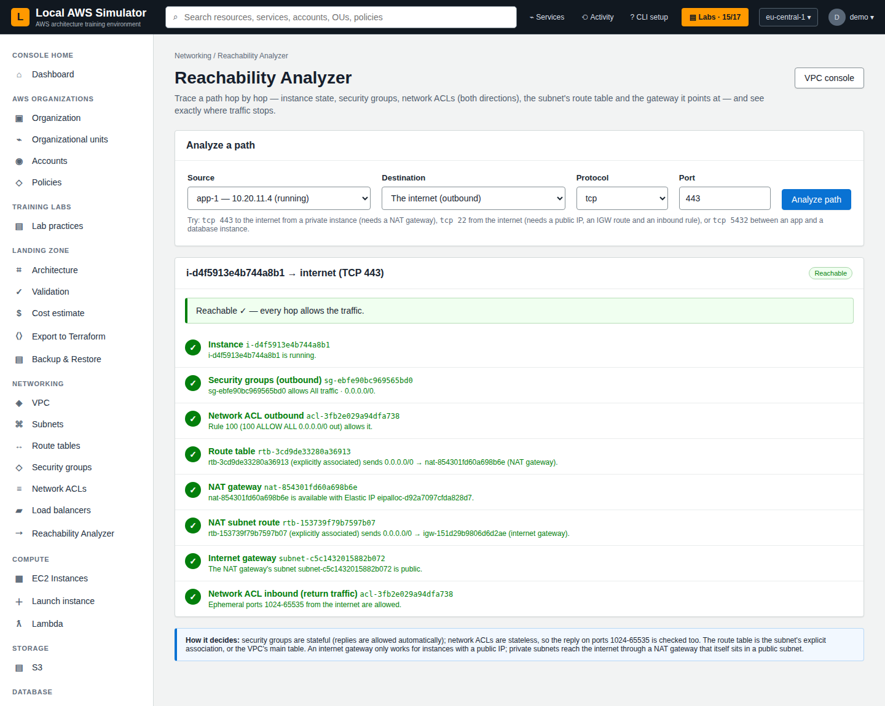 | 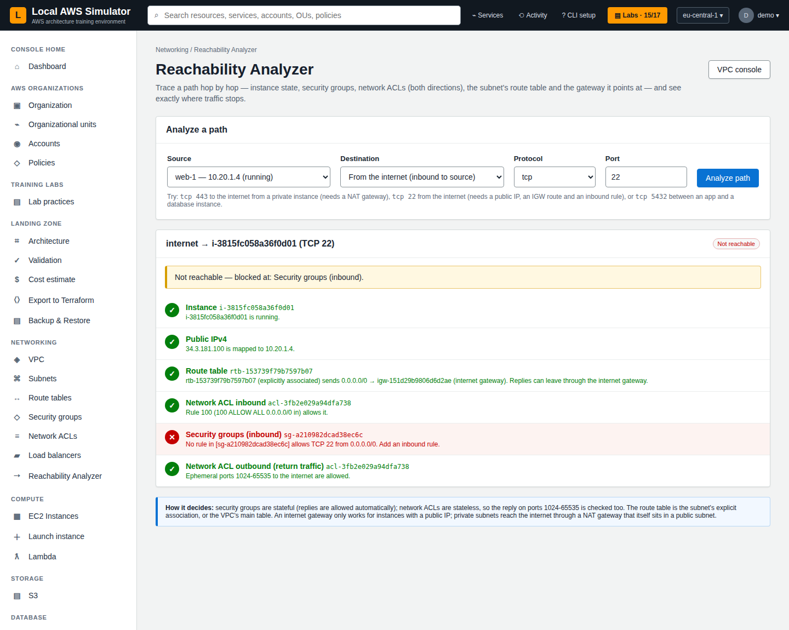 |

### Real VPC routing

Routes, subnet associations, security-group rules and NACL entries are real,
structured data, not free text. A subnet is **public** only when its route
table sends `0.0.0.0/0` to an attached internet gateway — exactly AWS's
definition. Every VPC gets its main route table, default security group and
default NACL; a fresh environment has a full default VPC.

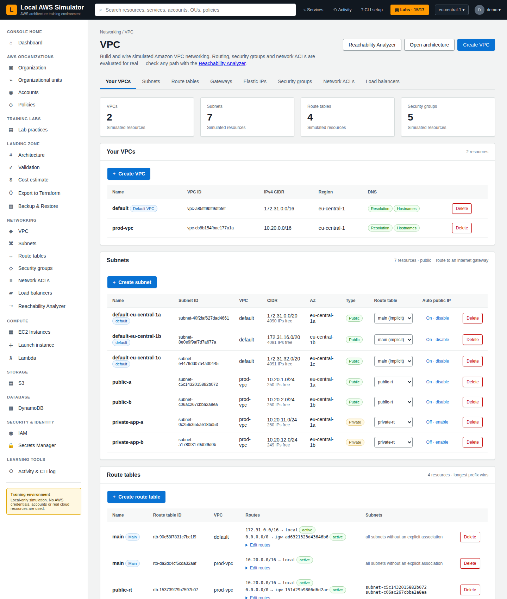

### Labs with step-by-step feedback

17 hands-on labs in a learning path, from the organization foundation to an
enterprise landing-zone capstone. Every step is checked against live state and
tells you exactly what is still missing ("Missing OUs: Production",
"No subnet routes 0.0.0.0/0 to an attached internet gateway yet").

| Learning path | Step checks |
|---|---|
| 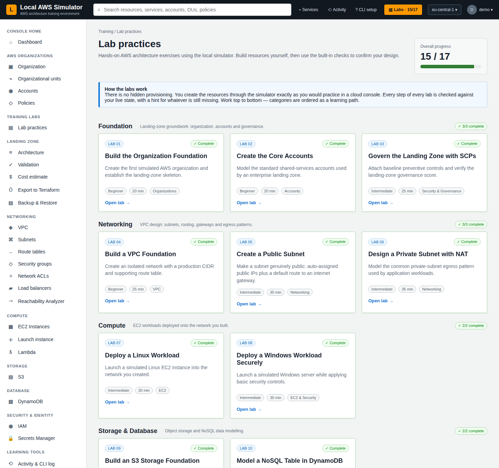 | 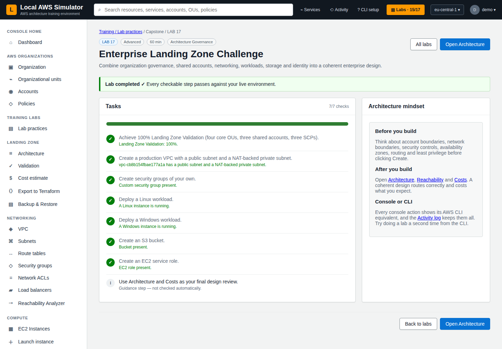 |

### Every click teaches the CLI

Each console action shows the equivalent `aws` command under the success
banner, and the **Activity & CLI log** keeps a CloudTrail-style record of
console actions *and* API calls from the CLI/SDK side by side.

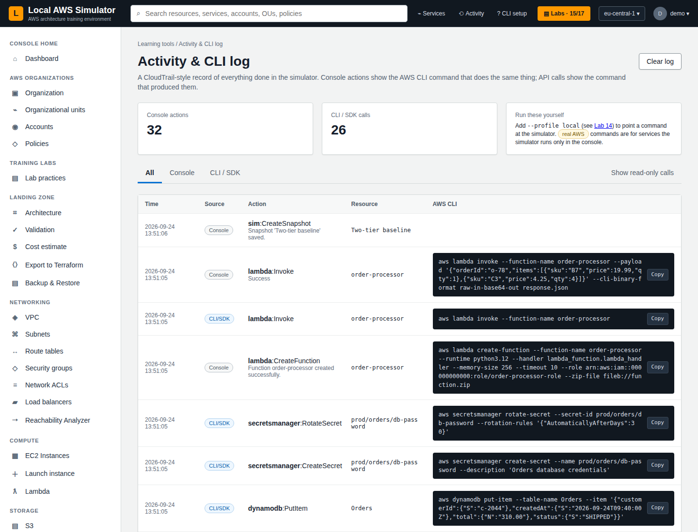

### What would this cost on AWS?

An approximate monthly bill for the environment (eu-central-1 on-demand
prices) with the lessons that matter: NAT gateways cost ~$38/month before
traffic, every public IPv4 is billed, stopped instances still pay for disks.

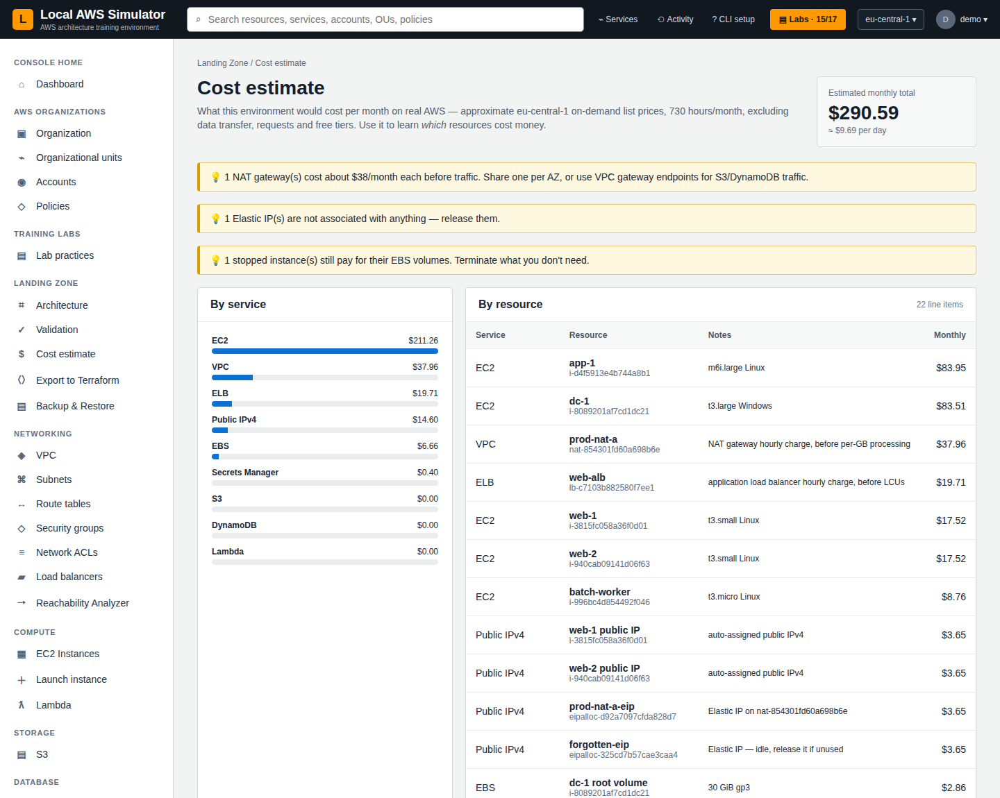

### Export to Terraform

Turn whatever you built into Terraform for the AWS provider. Resources reference
each other (`vpc_id = aws_vpc.prod_vpc.id`) instead of hard-coding IDs, so it
reads like hand-written infrastructure-as-code.

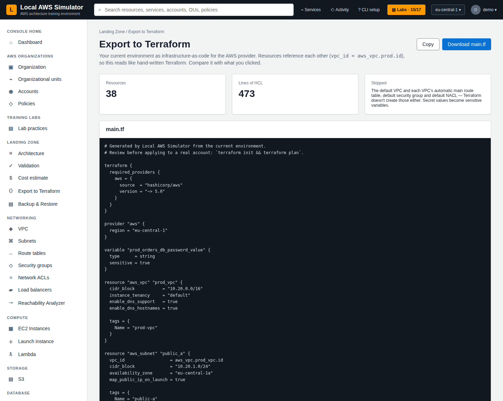

### Lambda functions that actually run

Python handlers execute in a separate process with the function's timeout
enforced and a Lambda-style `context`; the log includes the `REPORT` line with
duration and memory. Recent invocations from the console and the CLI are kept
per function.

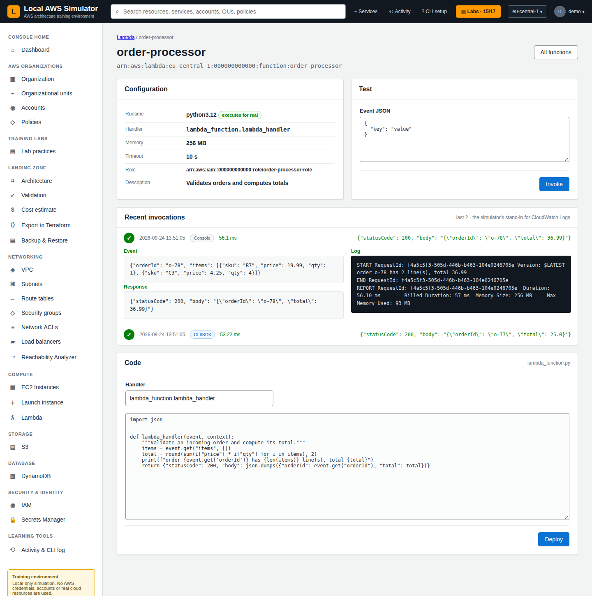

### Realistic EC2 lifecycle and a live architecture diagram

Instances go `pending → running`, `stopping → stopped`, `shutting-down →
terminated`, so `aws ec2 wait instance-running` works. Stopping releases an
auto-assigned public IP; termination protection is enforced. The Architecture
page draws VPCs, public/private subnets, instances, gateways and route tables
from live state.

| Instance | Architecture |
|---|---|
| 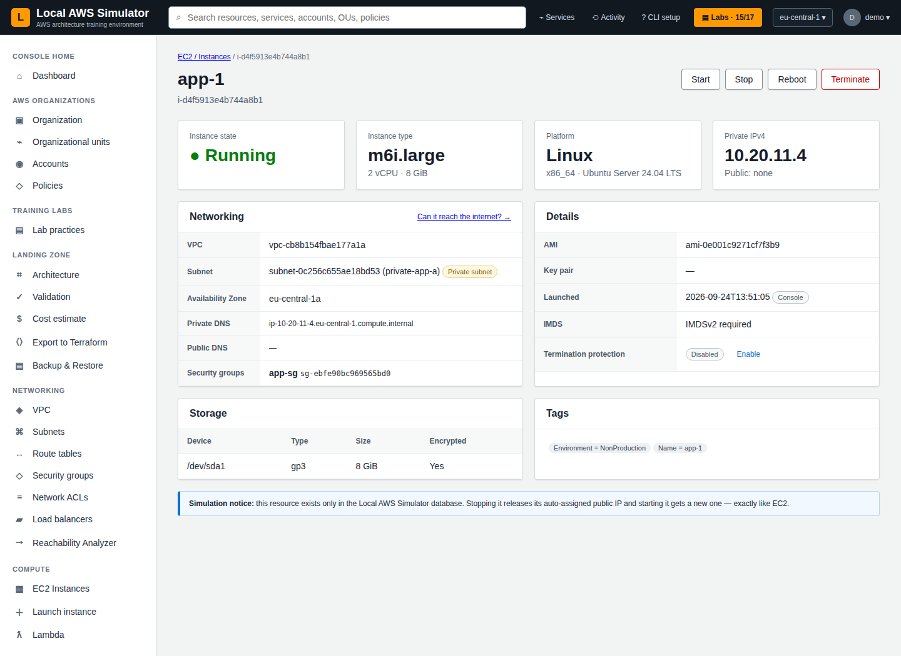 | 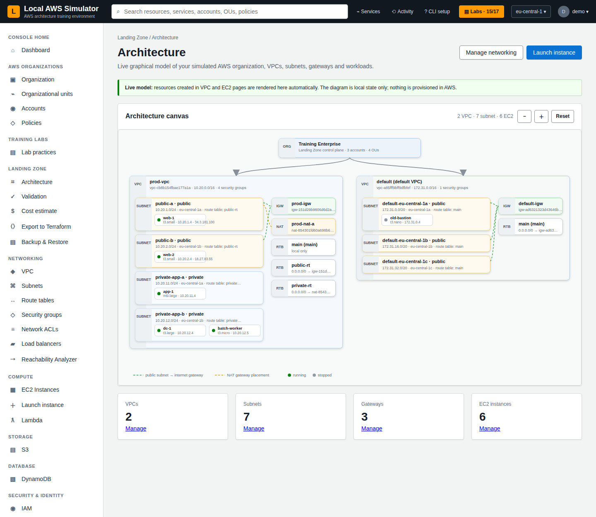 |

## Use the real AWS CLI or boto3

Point any AWS tool at `http://localhost:8080/aws`:

```bash
aws configure set profile.local.aws_access_key_id test
aws configure set profile.local.aws_secret_access_key test
aws configure set profile.local.region eu-central-1
aws configure set profile.local.endpoint_url http://localhost:8080/aws

aws --profile local sts get-caller-identity
aws --profile local ec2 create-vpc --cidr-block 10.20.0.0/16
aws --profile local s3 sync ./site s3://my-bucket/
aws --profile local lambda invoke --function-name adder --payload '{"a":1,"b":2}' \
    --cli-binary-format raw-in-base64-out out.json
```

Supported: **EC2/VPC** (VPCs, subnets, route tables, internet & NAT gateways,
Elastic IPs, security groups, network ACLs, instances, tags — with filters and
AWS error codes), **S3** (including `sync`, multipart and batch delete), **IAM**,
**STS**, **DynamoDB** (queries and update/condition expressions), **Secrets
Manager** and **Lambda**. The full walkthrough and support matrix are in
**[docs/aws-cli-tutorial.md](docs/aws-cli-tutorial.md)**.

## Labs

| # | Category | Lab |
|---|---|---|
| 1–3 | Foundation | Organization foundation · Core accounts · Governance with SCPs |
| 4–6 | Networking | VPC foundation · Public subnet (IGW routing) · Private subnet with NAT |
| 7–8 | Compute | Linux workload · Windows workload, securely |
| 9–10 | Storage & Database | S3 storage foundation · DynamoDB composite keys |
| 11–12 | Identity & Security | IAM baseline · Protecting credentials in Secrets Manager |
| 13 | Serverless | Deploy and run a Lambda function |
| 14 | Automation | Drive the simulator with the real AWS CLI |
| 15–17 | Capstone | Two-tier application · Serverless data pipeline · Enterprise landing zone |

## Configuration

| Variable | Default | Purpose |
|---|---|---|
| `SIM_DB` | `./simulator.db` | SQLite database path |
| `SIM_HOST` / `SIM_PORT` | `127.0.0.1` / `8080` | Bind address |
| `SIM_ALLOWED_HOSTS` | — | Extra host names to answer to (comma-separated; `*` for any) |
| `SIM_DEBUG` | off | `1` enables Flask debug mode |
| `SIM_AUTOLOGIN` | off | `1` skips the demo sign-in (kiosks, screenshots) |
| `SIM_TRANSITION_SECONDS` | `5` | How long `pending` / `stopping` / `shutting-down` last |
| `SIM_LAMBDA_EXEC` | on | `0` never executes Lambda code; invocations are simulated |

## Upgrading an existing environment

Keep your `simulator.db` where it is. On start the simulator upgrades it in
place: new columns are added, free-text routes and rules are converted to
structured ones (legacy `igw`/`nat` placeholders resolve to the VPC's gateway),
instances launched from the console get proper AWS IDs for their VPC, subnet
and security groups, duplicate S3 keys are collapsed to the newest object, and
each VPC gains the main route table / default security group / default NACL it
should always have had. Nothing is deleted. Old snapshots restore and are
upgraded the same way. Taking a snapshot (or copying the file) before the
first run is still a good habit.

## Security

The simulator is meant for your own machine. It binds to `127.0.0.1`, only
answers to local host names (defeating DNS-rebinding), and refuses cross-site
browser requests to both the console and the API, so a web page you visit
cannot drive it. The session key is generated per install (`.secret_key`,
never committed). Lambda execution runs the code *you* typed into your own
simulator; turn it off with `SIM_LAMBDA_EXEC=0` if you share the machine.

## Project layout

```
app.py              app factory, local-only guards, /aws route
db.py               schema, migrations, snapshots (single list of state tables)
netmodel.py         VPC behaviour shared by console and API (validation, routing, dependencies)
ec2model.py         instance placement and lifecycle
rules.py            structured routes / security-group / NACL rules
reachability.py     Reachability Analyzer
labs.py             lab catalogue and step checks
activity.py         activity log and CLI-equivalent builder
costs.py            monthly cost estimate
terraform_export.py Terraform generator
lambda_runtime.py   sandboxed Python execution for Lambda
aws_api/            wire protocols: ec2, s3, iam+sts, dynamodb, secretsmanager, lambda
views/              console blueprints
templates/          console pages
tests/              pytest suite (drives the API with real boto3)
tools/              demo_seed.py, cli_smoke.sh, screenshots.sh
```

## Development

```bash
pip install -r requirements-dev.txt
python -m pytest                     # ~80 tests, real boto3 against a live server
bash tools/cli_smoke.sh              # with the app running: real AWS CLI end-to-end
```

CI runs the test suite on Python 3.10–3.13 and the AWS CLI smoke test on every
push and pull request. Screenshots are regenerated with
`tools/demo_seed.py` + `tools/screenshots.sh` (headless Chrome).

## Important

No AWS credentials are used and no AWS API calls are made. No real VM, VPC,
subnet, IP address, disk or cloud service is created — resources are local
SQLite records. Costs shown are estimates for learning.

## Credits & Attribution

Parts of this simulator's behaviour — realistic resource-ID formats, the
auto-created default network, and the local API-endpoint approach for CLI
compatibility — were inspired by the excellent open-source
**[Floci](https://github.com/floci-io/floci)** local cloud emulator ecosystem
(MIT licensed). If you want a full-fidelity, multi-cloud emulator rather than
a training simulator, use it directly. Thanks to its maintainers for keeping
it free.
